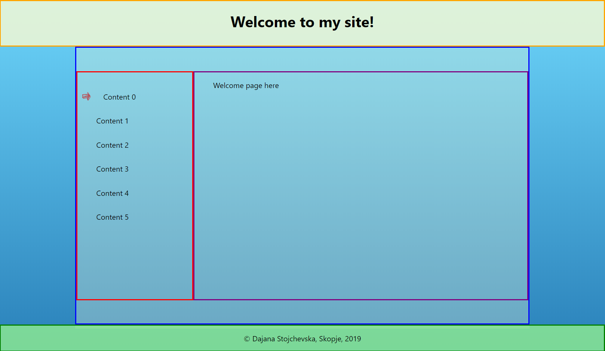

This project was bootstrapped with [Create React App](https://github.com/facebook/create-react-app).

How the template looks like: https://github.com/DajanaS/Static-Content-Website

## Get ready

You need to follow these steps for setting up the environment:
- Navigate in the project directory.
- You can first run `npm install` which will install all the needed packages.
- Then you can run `npm start` which runs the app in the development mode.
- Open [http://localhost:3000](http://localhost:3000) to view it in the browser.
    - The page will reload if you make edits.
    - You will also see any lint errors in the console.

**Note:** A prerequisite for this to work is to have [NodeJS](https://nodejs.org/en/download/) installed.

## Introduction

All the source code is inside [/src](./src) folder. There are three components, set into [/components](./src/components) and they are marked on the image below:

- The red border represents Main Container component.
- The green border represents Menu component.
- The blue border represents Content component.

There is a folder for each of the components where its source code is set (the .js file) and its stylesheet file (.scss).

## Set your own content
We need to adjust this site in order to have our own content displayed.
- For setting the content the only file that needs to be modified is [PagesIndex.js](./src/components).
- The pages are under the folder [/pages](./src/pages) and there we set the content for each.
- For better preview of some source code examples, I suggest to use the `<code>` tag around the code blocks.

## UI design

All style changes are done within the files .scss for the adequate component.
- For deleting the transparent window block of the [Main Container](./src/components/MainContainer/MainContainer.scss), delete whole `#main:after` block, there you could also change its opacity and background (currently black).
- For changing the text color of the [Menu](./src/components/Menu/Menu.scss) in yellow for example, set the property `color: yellow` into `#menu` block and the same can be applied for any other component.
- For changing the background, go to [App.scss](./src/App.scss) and change it under `body` block.

## Learn More

You can learn more in the [Create React App documentation](https://facebook.github.io/create-react-app/docs/getting-started).

To learn React, check out the [React documentation](https://reactjs.org/).